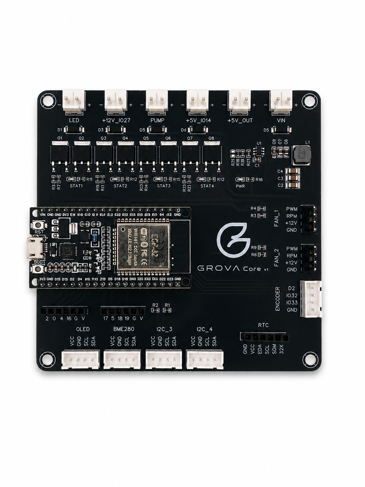

<div align="center">

# GROVA CORE

### Local-first climate automation for grow spaces, greenhouses and environmental control.

Built for makers, growers and automation builders who want to own their infrastructure,
not rent it from a cloud platform.

The Founder Edition Batch #01 is the first chance to get early GROVA hardware,
test it in real environments and help shape the product before wider release.

<br>

[](https://grova.carrd.co/)

</div>

<p align="center">
  
</p>

<div align="center">

[Visit GROVA Home](https://grova.carrd.co/)<br>
[Setup Guide](docs/setup.md)<br>
[Technical Documentation](docs/technical.md)<br>
[Hardware Reference](docs/hardware/README.md)

</div>

---

## What Is GROVA CORE?

GROVA CORE is open firmware for a local-first environmental automation controller.

It runs climate logic directly on the ESP32, controls real hardware outputs, reads local sensors and stays useful even when the internet, dashboard or cloud services are unavailable.

GROVA is designed for people who want practical automation hardware: inspectable, repairable, extendable and independent.

---

## Founder Edition Batch #01

<div align="center">

### First hardware. Real feedback. Early access.

Batch #01 is the first limited GROVA Core hardware run for early builders,
hardware testers, automation enthusiasts and growers.

Join the waitlist if you want to test GROVA in real environments, follow the hardware journey
and help shape the product before the next batch.

[Join Founder Edition Batch #01](https://grova.carrd.co/)

</div>

<table>
  <tr>
    <td width="50%">
      <h3>For Early Builders</h3>
      <p>The Founder Edition is the first limited hardware batch of the GROVA ecosystem.</p>
      <p>It is made for people who care about local control, open firmware and practical environmental automation.</p>
    </td>
    <td width="50%">
      <h3>Batch #01 Focus</h3>
      <ul>
        <li>Validate the first dedicated GROVA Core hardware</li>
        <li>Test real-world climate automation workflows</li>
        <li>Improve documentation and setup experience</li>
        <li>Collect feedback before broader production</li>
      </ul>
    </td>
  </tr>
</table>

---

## Batch Roadmap

<table>
  <tr>
    <td width="33%">
      <h3>Batch #01</h3>
      <p><b>Founder Edition</b></p>
      <p>Limited early hardware run for validation, feedback and hands-on testing.</p>
    </td>
    <td width="33%">
      <h3>Batch #02</h3>
      <p><b>Refined Developer Batch</b></p>
      <p>Hardware and firmware refinements based on Founder Edition feedback.</p>
    </td>
    <td width="33%">
      <h3>Batch #03</h3>
      <p><b>Production Candidate</b></p>
      <p>A more mature hardware revision prepared for wider availability.</p>
    </td>
  </tr>
</table>

---

## Hardware Direction

<table>
  <tr>
    <td width="50%">
      <h3>Founder Edition Target</h3>
      <ul>
        <li>ESP32-S3-WROOM-1-N16R8</li>
        <li>Native USB-C</li>
        <li>Dual PWM fan headers with tacho support</li>
        <li>12 V and 5 V MOSFET outputs</li>
        <li>8 independent I2C sensor expansion</li>
        <li>Dual 0-10V output</li>
        <li>OneWire, analog, flow and safety inputs</li>
        <li>OLED display, rotary encoder and status LED</li>
      </ul>
    </td>
    <td width="50%">
      <h3>Design Principles</h3>
      <ul>
        <li>Local-first operation</li>
        <li>Open firmware foundation</li>
        <li>Practical I/O for real environments</li>
        <li>No forced cloud dependency</li>
        <li>Expandable sensor and control architecture</li>
      </ul>
    </td>
  </tr>
</table>

---

## Why GROVA?

Most climate controllers are either closed, cloud-dependent or too limited for serious prototyping.

GROVA CORE takes a different route.

<table>
  <tr>
    <td width="33%">
      <h3>Local-first</h3>
      <p>Core automation keeps running directly on the controller, even without internet access.</p>
    </td>
    <td width="33%">
      <h3>Open Firmware</h3>
      <p>Built with ESP32, PlatformIO and documented interfaces for extension.</p>
    </td>
    <td width="33%">
      <h3>Automation-ready</h3>
      <p>MQTT, HTTP APIs, OTA updates and persistent runtime settings are built in.</p>
    </td>
  </tr>
  <tr>
    <td width="33%">
      <h3>Hardware-focused</h3>
      <p>Designed around real outputs, sensors and expansion points instead of cloud-only dashboards.</p>
    </td>
    <td width="33%">
      <h3>Offline Capable</h3>
      <p>ESP-local grow runs can continue applying phase targets and pump events without the server.</p>
    </td>
    <td width="33%">
      <h3>No Lock-in</h3>
      <p>No subscription, no forced cloud dependency and no vendor-controlled automation layer.</p>
    </td>
  </tr>
</table>

---

## Built For Real-World Environments

<table>
  <tr>
    <td width="33%">
      <h3>Smart Buildings</h3>
      <p>Monitor and automate server rooms, utility spaces, technical infrastructure and critical installations.</p>
    </td>
    <td width="33%">
      <h3>Greenhouse Automation</h3>
      <p>Maintain stable climate conditions with automated ventilation, humidity management and environmental monitoring.</p>
    </td>
    <td width="33%">
      <h3>Terrariums & Habitats</h3>
      <p>Control lighting, ventilation, misting systems and environmental sensors from a single controller.</p>
    </td>
  </tr>
  <tr>
    <td width="33%">
      <h3>Research & Development</h3>
      <p>Reliable environmental monitoring and automation for experiments, prototypes and controlled environments.</p>
    </td>
    <td width="33%">
      <h3>Indoor Agriculture</h3>
      <p>Flexible climate automation for controlled growing environments and precision cultivation systems.</p>
    </td>
    <td width="33%">
      <h3>Local Prototyping</h3>
      <p>Build and test climate-control workflows without cloud dependency, subscriptions or vendor lock-in.</p>
    </td>
  </tr>
</table>

---

## Core Capabilities

<table>
  <tr>
    <td width="33%">
      <h3>Environmental Monitoring</h3>
      <p>Connect temperature, humidity, pressure and environmental sensors through GROVA's modular sensor architecture.</p>
    </td>
    <td width="33%">
      <h3>Precision Ventilation</h3>
      <p>Automatically regulate airflow based on climate targets, sensor readings or custom automation logic.</p>
    </td>
    <td width="33%">
      <h3>High-Power Load Control</h3>
      <p>Drive fans, pumps, lighting, valves and auxiliary loads using dedicated MOSFET outputs.</p>
    </td>
  </tr>
  <tr>
    <td width="33%">
      <h3>Automation Profiles</h3>
      <p>Create autonomous schedules, grow phases and environmental control routines that can run locally on the ESP32.</p>
    </td>
    <td width="33%">
      <h3>Local Architecture</h3>
      <p>Core functionality continues operating without internet access, cloud services or a central server.</p>
    </td>
    <td width="33%">
      <h3>Open Integration</h3>
      <p>Use MQTT, HTTP APIs and Home Assistant-oriented discovery to connect GROVA with your own automation stack.</p>
    </td>
  </tr>
</table>

---

## Current Firmware Release

Current release: `v1.1.0`

<table>
  <tr>
    <td width="50%">
      <h3>Release Highlights</h3>
      <ul>
        <li>ESP-local offline grow presets</li>
        <li>Event-locked pump safety</li>
        <li>Persistent native Rest Mode</li>
        <li>Optional RTC support</li>
        <li>MQTT telemetry and command ACKs</li>
        <li>Versioned local HTTP APIs</li>
      </ul>
    </td>
    <td width="50%">
      <h3>Firmware Stack</h3>
      <ul>
        <li>ESP32 / ESP32-S3 target line</li>
        <li>Arduino framework</li>
        <li>PlatformIO build system</li>
        <li>Wi-Fi, MQTT and OTA support</li>
        <li>Persistent settings via ESP32 Preferences/NVS</li>
        <li>OLED and rotary encoder local interface</li>
      </ul>
    </td>
  </tr>
</table>

---

## Local-First Architecture

```text
Sensors and Outputs
        |
        v
GROVA Controller
        |
        v
ESP32 Firmware
        |
        +-- Local display and rotary encoder
        +-- Local HTTP API
        +-- Optional MQTT telemetry and commands
        +-- Optional dashboard, Home Assistant or Node-RED integration
```

The controller remains useful without a cloud service. Network integrations are optional layers, not the foundation.

---

## Quick Start

The full setup, configuration and flashing instructions are kept outside this README so the front page stays clean.

- [Setup Guide](docs/setup.md)
- [Technical Documentation](docs/technical.md)
- [Firmware Profiles](docs/firmware-profiles.md)

---

## Documentation

<table>
  <tr>
    <td width="50%"><b>Setup and flashing</b><br><a href="docs/setup.md">docs/setup.md</a></td>
    <td width="50%"><b>Technical documentation</b><br><a href="docs/technical.md">docs/technical.md</a></td>
  </tr>
  <tr>
    <td width="50%"><b>Firmware profiles</b><br><a href="docs/firmware-profiles.md">docs/firmware-profiles.md</a></td>
    <td width="50%"><b>HTTP and MQTT API</b><br><a href="docs/api.md">docs/api.md</a></td>
  </tr>
  <tr>
    <td width="50%"><b>Display and encoder UI</b><br><a href="docs/display-ui.md">docs/display-ui.md</a></td>
    <td width="50%"><b>Pump safety</b><br><a href="docs/pump-safety.md">docs/pump-safety.md</a></td>
  </tr>
  <tr>
    <td width="50%"><b>Hardware reference</b><br><a href="docs/hardware/README.md">docs/hardware/README.md</a></td>
    <td width="50%"><b>Changelog</b><br><a href="CHANGELOG.md">CHANGELOG.md</a></td>
  </tr>
</table>

---

## Repository Scope

This repository contains the standalone GROVA cube firmware.

Included:

```text
src/
include/
lib/
test/
docs/
platformio.ini
```

Not included:

```text
secrets
local deployment files
dashboard backend
server stack
databases
logs
backups
```

---

## Project Status

GROVA CORE is in active prototype development.

The firmware is already capable of local climate control, MQTT telemetry, OTA updates, local web APIs, persistent settings, Rest Mode and ESP-local grow runs.

Founder Edition Batch #01 is being prepared now. The waitlist is open for people who want early access, development updates and a chance to influence the first hardware release.

<div align="center">

## Want to be part of Batch #01?

Get early access updates and follow the first GROVA Core hardware release.

[Join Founder Edition Batch #01](https://grova.carrd.co/)<br>
[Visit GROVA Home](https://grova.carrd.co/)

</div>

---

## License

GROVA CORE firmware is released under the GNU General Public License v3.0.

See [LICENSE](LICENSE).

---

<div align="center">

## Own your environment.

Local-first climate automation. Open firmware. No forced cloud.

[Join Founder Edition Batch #01](https://grova.carrd.co/)

</div>
